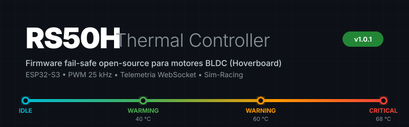
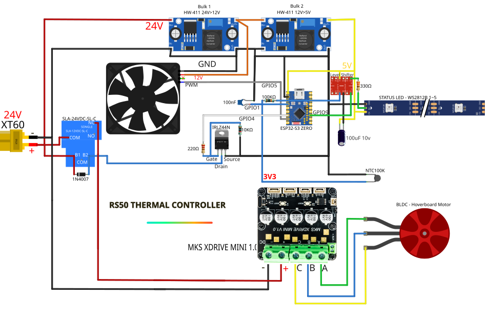

# RS50H Thermal Controller

> Firmware open-source para controle térmico de motores BLDC (hoverboard) em bancadas de sim-racing,
> baseado em **ESP32-S3-Zero (Waveshare)** + NTC 100 kΩ B3950 + ventoinha PWM 25 kHz.

[](https://github.com/Jean-DrEaD/rs50h-thermal-controller/actions)
[](https://github.com/Jean-DrEaD/rs50h-thermal-controller/releases)
[](CHANGELOG.md)
[](LICENSE)
[](https://www.espressif.com/en/products/socs/esp32-s3)
[](https://arduino.github.io/arduino-cli/)
[](https://github.com/Jean-DrEaD/rs50h-thermal-controller/commits/main)

---

## ✨ Features

- 🌡 Leitura NTC com equação de Steinhart-Hart (B3950, 100 kΩ, média N=8)
- 🛑 Detecção automática de sensor desconectado/curto (`--.-`) com fail-safe imediato
- 💨 Curva PWM linear 25 kHz entre `TEMP_FAN_ON` e `TEMP_WARNING`
- 💡 LEDs WS2812 indicando estado FSM em tempo real (azul/verde/amarelo/vermelho/magenta)
- 🔒 Topologia **fail-safe NC**: relé isola apenas o +24 V do ODESC FFBeast — motor continua se ESP travar
- 📊 Dashboard web local embarcado em PROGMEM (HTML único, sem dependências externas)
- 📡 Telemetria WebSocket @ 2 Hz + UDP SimHub @ 1 Hz
- 🔄 OTA fail-safe: `fan = 100 %`, `relay = LOW`, LEDs magenta durante upload
- ⚡ Diodo flyback 1N4007 protegendo IRLZ44N contra spikes indutivos da bobina 24 V
- 🔐 Basic Auth HTTP/WS + senha OTA + thresholds persistentes via NVS

---

## 📂 Estrutura do repositório

```
rs50h-thermal-controller/
│
├── README.md                        ← este arquivo
├── CHANGELOG.md                     ← histórico de versões (SemVer)
├── LICENSE                          ← MIT
├── PROJECT.md                       ← referência técnica estável (stack, FSM, segurança)
├── CONTEXT.md                       ← estado atual de desenvolvimento
├── CONTRIBUTING.md                  ← guia para contribuidores
├── SECURITY.md                      ← política de segurança e reporte de vulnerabilidades
├── AUDIT_REPORT.md                  ← relatório de auditoria de baixo nível v2
│
├── docs/
│   ├── WIRING.md                    ← diagrama de fiação completo ⭐
│   ├── LEVEL_SHIFTER.md             ← auditoria GPIO9: por que e como usar o BSS138 ⭐
│   ├── CI_CD.md                     ← documentação do pipeline GitHub Actions
│   ├── HERITAGE.md                  ← rastreabilidade RS50 v3.3.13 → RS50H v1.0.0
│   ├── banner.svg                   ← logo/banner do projeto
│   ├── wiring-schematic.svg         ← esquemático visual da pinagem
│   ├── wiring-ascii.txt             ← diagrama ASCII (fonte da verdade de hardware)
│   └── dashboard-source.html        ← fonte editável do dashboard web
│
├── include/
│   └── config.h.example             ← template de configuração (commitar este; NUNCA config.h)
│
├── src/rs50h_thermal/
│   ├── rs50h_thermal.ino            ← sketch principal (v1.0.1)
│   └── dashboard.h                  ← dashboard web embutido em PROGMEM
│
├── ci/
│   └── libraries.txt                ← FastLED@3.6.0 + WebSockets@2.4.1 (versões fixas)
│
├── scripts/
│   ├── README.md                    ← guia dos scripts PowerShell
│   ├── extract_dashboard.py         ← extrai/verifica sincronismo do dashboard
│   └── ps/                          ← scripts PowerShell de audit, commit, push, release
│
└── .github/workflows/
    ├── build.yml                    ← CI: compila em cada push/PR
    └── release.yml                  ← CD: build + GitHub Release em cada tag v*.*.*
```

---

## ⚡ Hardware necessário (BOM)

| Qtde | Componente | Notas |
|------|------------|-------|
| 1 | ESP32-S3-Zero (Waveshare) | MCU principal — 512 kB SRAM, 4 MB Flash, sem PSRAM |
| 1 | Relé Songle SLA-24VDC-SL-C | NC, SPDT, 30 A |
| 1 | MOSFET IRLZ44N | Logic-level gate; aciona bobina 24 V |
| 1 | Diodo 1N4007 | Flyback na bobina do relé |
| 2 | LM2596 (HW-411) | 24 V → 12 V e 12 V → 5 V |
| 1 | NTC 100 kΩ B3950 | Encapsulado, montado no estator |
| 1 | Fan 120 mm PWM 12 V | 4-pinos, 25 kHz; sinal 3,3 V aceito diretamente |
| 1 | WS2812 (tira ou módulo, 5 LEDs) | VCC = 5 V; DIN via level shifter |
| 1 | **BSS138 4-CH Bidirectional Level Shifter** | **Necessário para GPIO9 → WS2812 DIN** |
| 1 | Resistor 330 Ω | Entre saída HV1 do BSS138 e DIN do WS2812 |
| 1 | Resistor 220 Ω | Gate do IRLZ44N |
| 1 | Resistor 10 kΩ | Pull-down Source do IRLZ44N |
| 1 | Resistor 100 kΩ 1% | Pull-up divisor NTC |
| 1 | Capacitor 100 nF | Filtro GPIO1 (NTC) |

> O módulo BSS138 4-CH é necessário porque o ESP32-S3-Zero opera em lógica 3,3 V e o
> WS2812 exige VIH ≥ 3,5 V. Ver [`docs/LEVEL_SHIFTER.md`](docs/LEVEL_SHIFTER.md) para diagnóstico completo.

---

## 📌 Pinagem ESP32-S3-Zero (Waveshare)

> ⚠️ Esta pinagem é válida **exclusivamente** para o
> [ESP32-S3-Zero da Waveshare](https://www.waveshare.com/esp32-s3-zero.htm).
> Outros módulos ESP32-S3 têm mapeamento físico diferente.

| GPIO | Função | Macro | Notas |
|------|--------|-------|-------|
| 1 | NTC ADC | `PIN_NTC` | Divisor 100 kΩ 1% + cap 100 nF |
| 4 | Gate MOSFET | `PIN_RELAY` | 220 Ω série + pull-down 10 kΩ |
| 5 | PWM Fan 25 kHz | `PIN_FAN_PWM` | 3,3 V lógico direto ao conector do fan |
| 9 | WS2812 Data | `PIN_WS2812` | **Via BSS138 LV1 → HV1 → 330 Ω → DIN** |
| 21 | ⚠️ Não usar | — | LED RGB onboard — causa boot-loop |

---

## 🌡️ FSM de Temperatura

| Faixa | Estado | Ação | LED |
|-------|--------|------|-----|
| < 40 °C | `IDLE` | Fan OFF, Relé fechado | 🔵 Azul |
| 40–60 °C | `WARMING` | PWM proporcional, Relé fechado | 🟢 Verde |
| 60–68 °C | `WARNING` | PWM 100 %, Relé fechado | 🟡 Amarelo |
| ≥ 68 °C | `CRITICAL` | PWM 100 %, Relé **abre** (motor para) | 🔴 Vermelho |
| < 58 °C (pós-CRITICAL) | `RESTART` | Relé fecha, volta a `WARMING` | 🟢 Verde |
| (OTA ativo) | — | Fan 100 %, Relé LOW, LEDs magenta | 🟣 Magenta |

**Histerese:** 10 °C (CRITICAL em 68 °C → RESTART quando temp < 58 °C)

---

## 🚀 Início rápido

### 1. Pré-requisitos

```bash
arduino-cli version  # deve ser 1.1.1 — ver CONTRIBUTING.md para instalação
arduino-cli core install esp32:esp32@2.0.14
arduino-cli lib install FastLED@3.6.0
arduino-cli lib install WebSockets@2.4.1
```

### 2. Configuração

```bash
cp include/config.h.example include/config.h
# Editar include/config.h:
#   WIFI_SSID / WIFI_PASS
#   OTA_PASSWORD     (mínimo 12 chars)
#   HTTP_AUTH_USER / HTTP_AUTH_PASS  (nunca admin/admin)
#   AP_FALLBACK_PASS
```

### 3. Compilar

```powershell
arduino-cli compile `
  --fqbn "esp32:esp32:esp32s3:USBMode=hwcdc,CDCOnBoot=cdc,FlashMode=qio,FlashSize=4M,PartitionScheme=default,PSRAM=disabled" `
  --build-property "compiler.cpp.extra_flags=-I$((Get-Location).Path.Replace('\','/'))/include" `
  src\rs50h_thermal
```

### 4. Upload

```powershell
arduino-cli upload `
  -p COM5 `
  --fqbn "esp32:esp32:esp32s3:USBMode=hwcdc,CDCOnBoot=cdc,FlashMode=qio,FlashSize=4M,PartitionScheme=default,PSRAM=disabled" `
  src\rs50h_thermal
```

### 5. Monitor serial

```powershell
arduino-cli monitor -p COM5 -c baudrate=115200
```

---

## 🔌 Wiring



| Arquivo | Conteúdo |
|---------|----------|
| [`docs/WIRING.md`](docs/WIRING.md) | Diagrama de fiação completo com todas as seções |
| [`docs/LEVEL_SHIFTER.md`](docs/LEVEL_SHIFTER.md) | **Por que e como usar o BSS138 no GPIO9** |
| [`docs/wiring-ascii.txt`](docs/wiring-ascii.txt) | Fonte da verdade de hardware (ASCII art) |
| [`docs/wiring-schematic.svg`](docs/wiring-schematic.svg) | Esquemático visual |

---

## 📚 Documentação

| Arquivo | Conteúdo |
|---------|----------|
| [`PROJECT.md`](PROJECT.md) | Referência técnica: stack, FSM, segurança, topologia fail-safe |
| [`CONTEXT.md`](CONTEXT.md) | Estado atual de desenvolvimento, decisões abertas, próximos passos |
| [`CHANGELOG.md`](CHANGELOG.md) | Histórico de versões (SemVer) |
| [`CONTRIBUTING.md`](CONTRIBUTING.md) | Guia de configuração local, compilação, convenções de commit |
| [`SECURITY.md`](SECURITY.md) | Política de segurança, superfície de ataque, reporte de vulnerabilidades |
| [`AUDIT_REPORT.md`](AUDIT_REPORT.md) | Relatório de auditoria de baixo nível v2 (todos os itens aplicados) |
| [`docs/CI_CD.md`](docs/CI_CD.md) | Pipeline GitHub Actions: build.yml e release.yml |
| [`docs/HERITAGE.md`](docs/HERITAGE.md) | Rastreabilidade RS50 v3.1.0 → RS50H v1.0.0 |
| [`scripts/README.md`](scripts/README.md) | Guia dos scripts PowerShell de audit, commit, push e release |

---

## 🏗️ Release

```powershell
# 1. Commit via script interativo
.\scripts\ps\commit.ps1

# 2. Push main
.\scripts\ps\03_push.ps1

# 3. Tag → dispara release.yml automaticamente (build + GitHub Release)
git tag -a v1.0.1 -m "RS50H v1.0.1 descrição"
git push origin v1.0.1

# Ou via script:
.\scripts\ps\04_tag_release.ps1
.\scripts\ps\05_ci_watch.ps1   # monitora Actions em tempo real
```

---

## ⚠️ Notas importantes

- **Arduino core fixado em `2.0.14`** — a API LEDC legada (`ledcSetup` / `ledcAttachPin`)
  foi removida no core v3.x. Não atualizar sem migrar as chamadas PWM.
- **`PSRAM=disabled` obrigatório** — o ESP32-S3-Zero (Waveshare) não possui PSRAM.
- **`config.h` nunca commitar** — contém credenciais locais. Está no `.gitignore`.
- **GPIO9 requer level shifter** — WS2812 com VCC = 5 V exige VIH ≥ 3,5 V;
  GPIO9 em 3,3 V está fora de spec sem o BSS138. Ver [`docs/LEVEL_SHIFTER.md`](docs/LEVEL_SHIFTER.md).
- **Não expor na internet** — projetado para LAN doméstica / bancada de sim-racing.

---

## 📜 License

MIT © Jean-DrEaD

> "RS50H" refere-se a *Hoverboard* (motor BLDC extraído de hoverboard).
> Sem qualquer relação com produtos Logitech ou similares.
